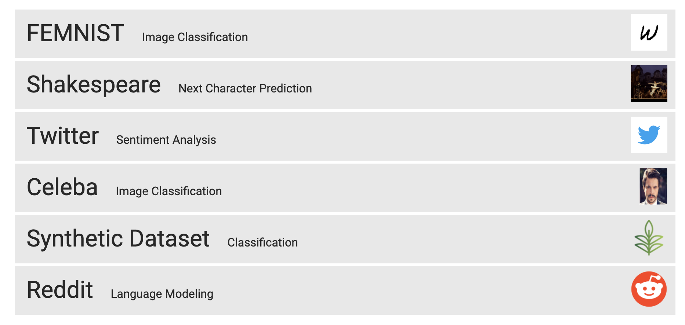

# Benchmarks

## Federated Learning
- [LEAF](./Federated Learning/LEAF.md)
  - LEAF is a benchmarking framework for learning in federated settings, with applications including federated learning, multi-task learning, meta-learning, and on-device learning. 
  - 

